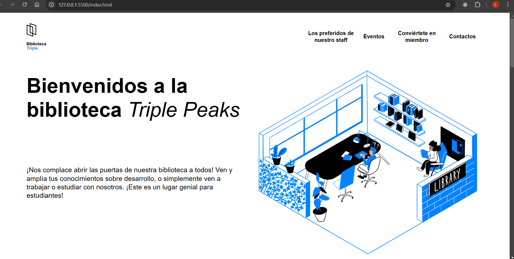
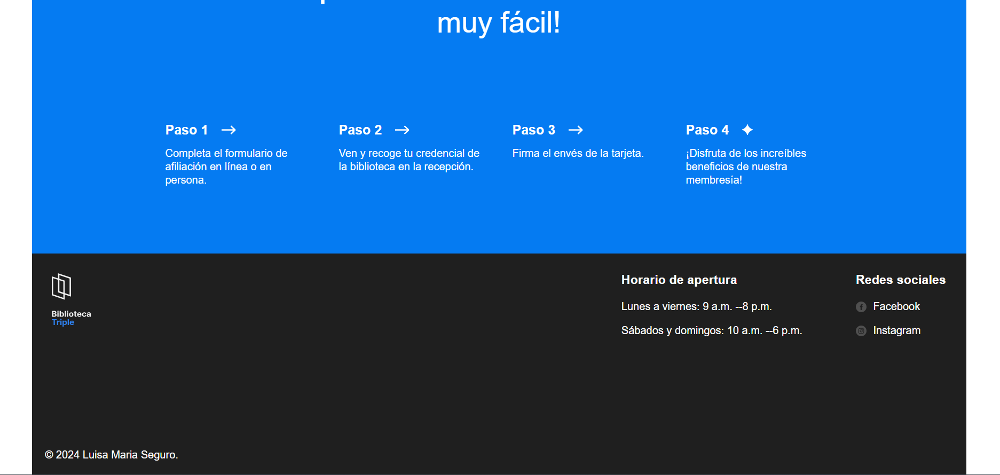
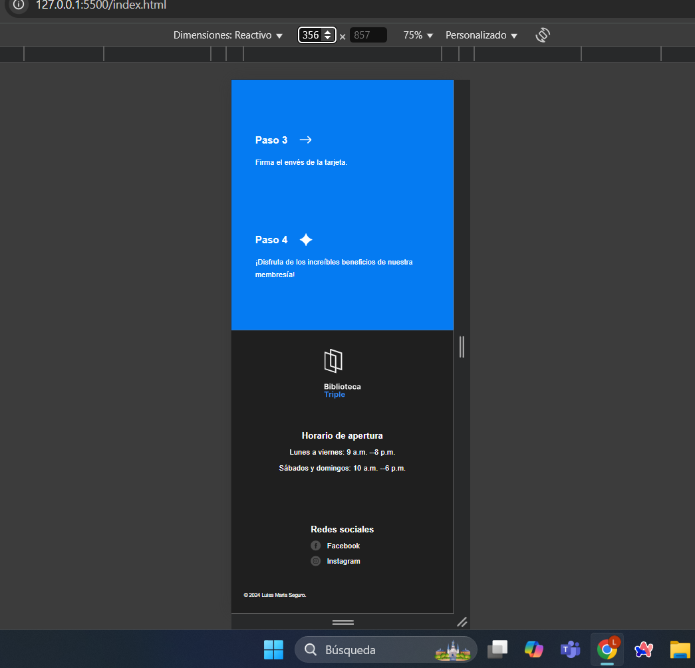
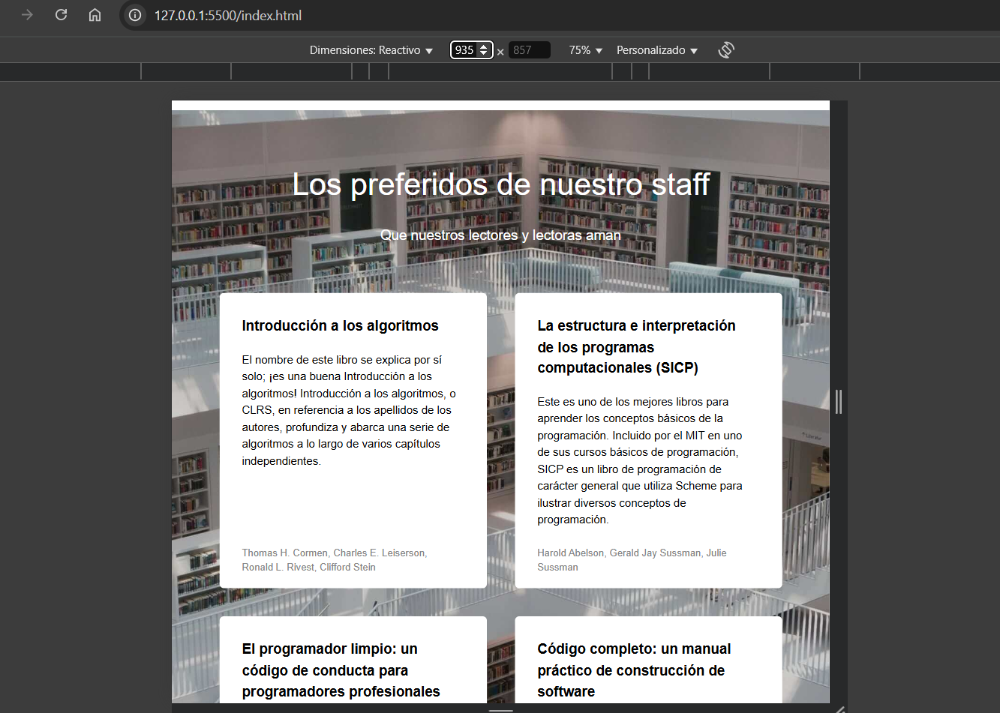

# Web Project Library

Este es uno de mis primeros proyectos creado con HTML y CSS, en el que apliqué mis conocimientos sobre estructura, estilos y diseño responsivo utilizando Flexbox, Grid y media queries.

## Características

_Estructura en HTML:_ Código semántico y bien organizado.

_Estilos en CSS:_ Uso de selectores, clases y estilos personalizados.

_Diseño Responsivo:_ Adaptable a diferentes tamaños de pantalla desde 320px hasta 1400px.

_Flexbox y Grid:_ Implementación de estas técnicas para el diseño y distribución de los elementos en la página.

_Media Queries:_ Ajustes para mejorar la visualización en distintos dispositivos.

## Tecnologías Utilizadas

HTML5

CSS3

Flexbox y Grid

Media Queries

## Cómo Ver el Proyecto

_Clonar el repositorio:_

git clone git@github.com:LuisaMSegur/web_project_library.git

_Abrir el archivo index.html en el navegador._

_también puedes abrir enlace:_ https://luisamsegur.github.io/web_project_library/
